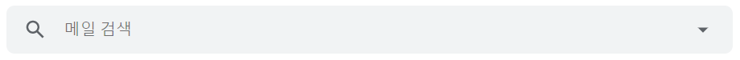
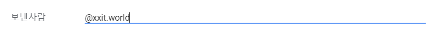
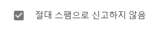
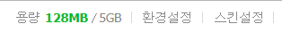
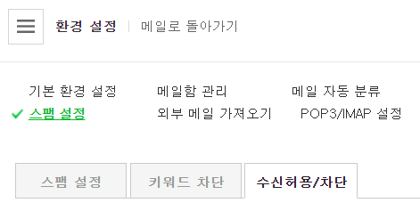
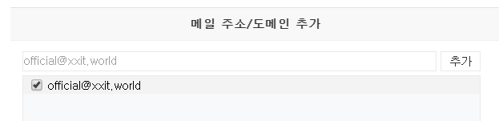
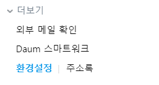
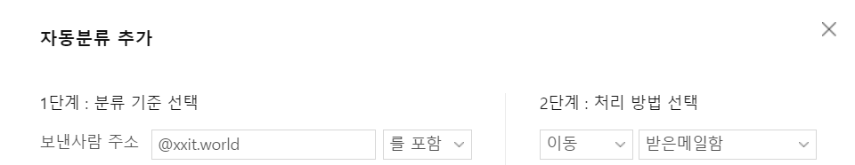

# No-Spam-Mail

> 단체 메일을 많이 보내서인지 자꾸 스팸메일로 분류되어서 해결하기 전까지는 
> 받는 사람쪽에서 스팸으로 분류되지 않도록 설정하는 방법을 안내하기 위한 문서

- [Gmail](#Gmail)
- [Naver](#Naver)
- [Daum](#Daum)

## Gmail

1. 페이지 상단 검색 바 우측에 아래방향 화살표를 클릭하여 선택창을 엽니다.

2. 보낸 사람(from) 입력상자 안에 **@xxit.world** 입력합니다.

3. 하단에 "필터 만들기"를 클릭합니다.
4. "절대 스팸으로 신고하지 않음"을 선택합니다.

5. "필터 만들기"를 클릭합니다.

## Naver

1. 왼쪽 하단의 "환경설정"을 클릭합니다.

2. "스팸 설정"에서 "수신허용/차단"탭을 클릭합니다.

3. "메일 주소/도메인 추가"에 **official@xxit.world**를 입력하고 "추가"를 클릭합니다.

4. "확인"을 클릭합니다.

## Daum

1. 왼쪽 하단의 "환경설정"을 클릭합니다.

2. "자동분류"탭에서 "추가" 버튼을 클릭합니다.
3. "보낸사람 주소"에 **@xxit.world**를 입력하고, 처리 방법은 "받은 메일함"을 선택 후 저장합니다.
